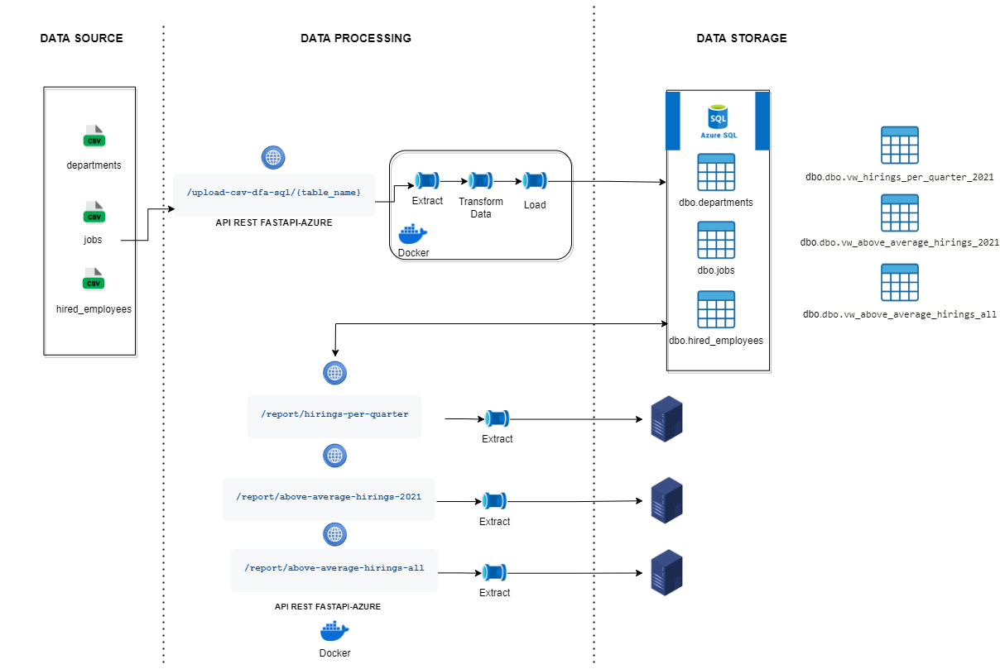
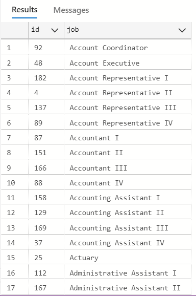
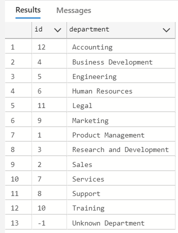
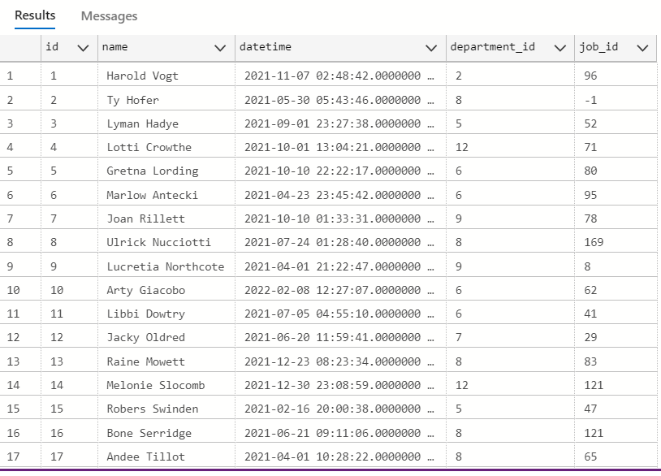
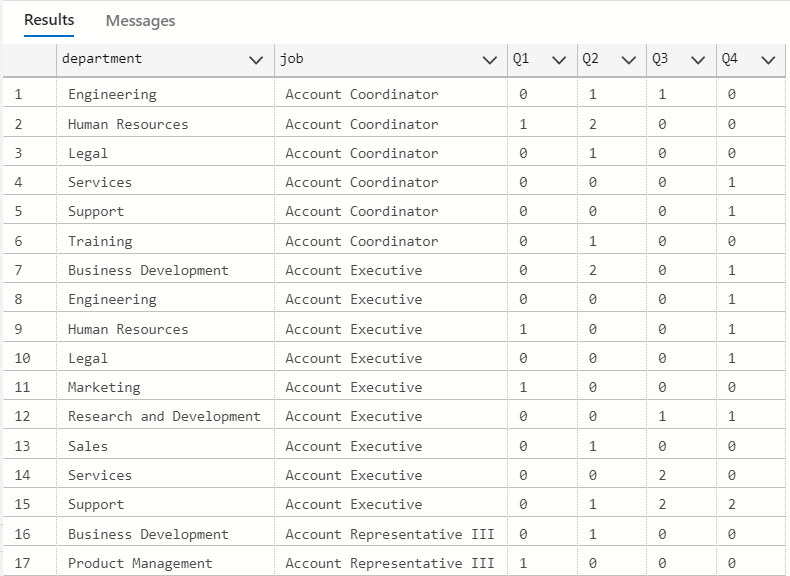
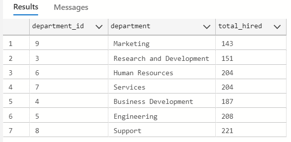
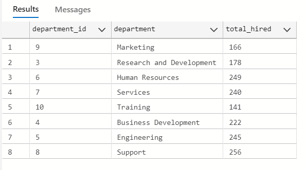
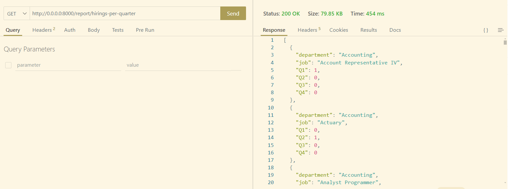
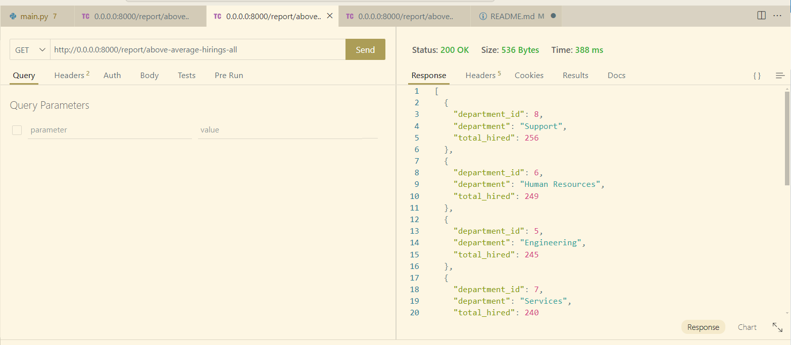
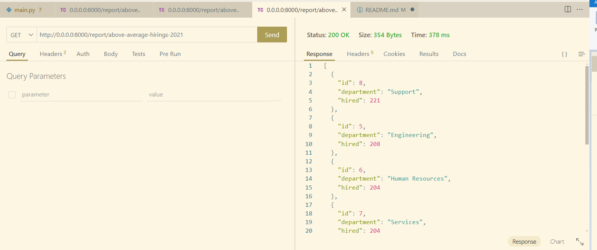

# FastAPI - Azure SQL API Project

This project implements a REST API using **FastAPI**, connected to an **Azure SQL** database. Its main goal is to streamline the upload, validation, storage, and querying of employee hiring data across departments and jobs.

---

## 🔍 Project Structure

```
fastapi-azure/
├── app/
│   ├── main.py               # Main file with all endpoints
│   ├── db.py                 # DB connection setup
│   ├── models.py             # ORM models with SQLAlchemy
│   ├── schemas.py            # Pydantic schemas (optional/future use)
│   ├── db_utils.py           # Utility functions for chunked reading
│   └── main_deprecated.py    # Old version of main (optional)
```

---

## 🚀 Key Features

- Upload `.csv` files to populate `departments`, `jobs`, and `hired_employees` tables.
- Deduplication using pandas merge vs database content.
- Automatic handling of nulls, date conversion, and foreign keys.
- Efficient memory usage with chunked loading (`chunksize=1000`).
- Reporting endpoints to analyze hiring metrics.

---

## 🛠️ Run the App with Docker

To **start the app** using Docker Compose:
```bash
docker compose -f docker-compose.yml up --build
```

To **stop the app**:
```bash
docker compose -f docker-compose.yml down
```

---

## 🔗 Main Endpoints

### 1. Upload CSV files (validated and deduplicated)
Endpoint:
```http
POST /upload-csv-dfa-sql/{table_name}
```
Allowed `table_name` values:
- `hired_employees`
- `departments`
- `jobs`

#### 🚗 CURL examples
```bash
curl -X POST http://localhost:8000/upload-csv-dfa-sql/hired_employees -F "file=@hired_employees.csv"
curl -X POST http://localhost:8000/upload-csv-dfa-sql/departments -F "file=@departments.csv"
curl -X POST http://localhost:8000/upload-csv-dfa-sql/jobs -F "file=@jobs.csv"
```

#### 📏 Postman instructions
- Method: `POST`
- URL: `http://localhost:8000/upload-csv-dfa-sql/{table_name}`
- Body: `form-data`
  - Key: `file`
  - Type: `File`
  - Value: Select your `.csv` file from disk

---

### 2. Quarterly hiring by job and department (2021)
- **Description**: Total employees hired for each job and department in 2021, divided by quarter. Sorted alphabetically by department and job.
- **Endpoint**:
```http
GET http://0.0.0.0:8000/report/hirings-per-quarter
```

### 3. Departments above average hiring in 2021
- **Description**: Departments with more hires than the 2021 average. Ordered descending by total hires.
- **Endpoint**:
```http
GET http://0.0.0.0:8000/report/above-average-hirings-2021
```

### 4. Departments above 2021 average (all time)
- **Description**: Departments whose total hiring (all time) exceeds the average of all departments in 2021.
- **Endpoint**:
```http
GET http://0.0.0.0:8000/report/above-average-hirings-all
```

---

## 📊 Utility Functions (`app/db_utils.py`)

```python
load_dataframe_chunks(model, columns, db_bind, chunksize=1000)
```
Loads a table in memory-safe chunks using SQLAlchemy and pandas. Returns a full combined DataFrame.

---

## 🛡️ Validation Rules

- Skip duplicates using pandas `merge()`
- Convert timezone-aware datetimes to naive for proper comparison
- Fill nulls with defaults (e.g., "Unknown", `-1`)
- Exclude dates before `1753-01-01` (SQL Server valid range)


## 📌 Project Architecture

### 🔄 General Data Flow Diagram
This diagram illustrates the complete workflow: from uploading `.csv` files via a **FastAPI-based REST API**, to storing them in **Azure SQL**, and finally exposing endpoints for querying and reporting.

<p align="center">
  
</p>

---

## 🚀 Data Upload via API Endpoints

### 🧾 Example of `curl` requests to insert data:

```bash
# Upload departments
$ curl -X POST http://localhost:8000/upload-csv-dfa-sql/departments -F "file=@departments.csv"
{"message":"12 new records inserted into 'departments'","duplicates_skipped":0,"defaults_applied":{"department":0}}

# Upload jobs
$ curl -X POST http://localhost:8000/upload-csv-dfa-sql/jobs -F "file=@jobs.csv"
{"message":"183 new records inserted into 'jobs'","duplicates_skipped":0,"defaults_applied":{"job":0}}

# Upload hired employees
$ curl -X POST http://localhost:8000/upload-csv-dfa-sql/hired_employees -F "file=@hired_employees.csv"
{"message":"1999 new records inserted into 'hired_employees'","duplicates_skipped":0,"defaults_applied":{"name":19,"department_id":21,"job_id":16,"datetime":14}}
```

---

## 📊 SQL Queries and Results

### 🔎 Preview of base tables

```sql
SELECT * FROM dbo.jobs;
```


```sql
SELECT * FROM dbo.departments;
```


```sql
SELECT * FROM dbo.hired_employees;
```


---
## 📄 SQL Views Definition

The following views were created in **Azure SQL** to support the reporting endpoints. You can use or adapt these queries according to your own data sources.

---

### 📘 `vw_hirings_per_quarter_2021`

```sql
IF OBJECT_ID('vw_hirings_per_quarter_2021', 'V') IS NOT NULL
    DROP VIEW vw_hirings_per_quarter_2021;
GO

CREATE VIEW vw_hirings_per_quarter_2021 AS
SELECT 
    d.department,
    j.job,
    SUM(CASE WHEN DATEPART(QUARTER, h.datetime) = 1 THEN 1 ELSE 0 END) AS Q1,
    SUM(CASE WHEN DATEPART(QUARTER, h.datetime) = 2 THEN 1 ELSE 0 END) AS Q2,
    SUM(CASE WHEN DATEPART(QUARTER, h.datetime) = 3 THEN 1 ELSE 0 END) AS Q3,
    SUM(CASE WHEN DATEPART(QUARTER, h.datetime) = 4 THEN 1 ELSE 0 END) AS Q4
FROM 
    dbo.hired_employees h
JOIN 
    dbo.departments d ON h.department_id = d.id
JOIN 
    dbo.jobs j ON h.job_id = j.id
WHERE 
    YEAR(h.datetime) = 2021
GROUP BY 
    d.department, j.job;
GO
```

---

### 📗 `vw_above_average_hirings_2021`

```sql
IF OBJECT_ID('vw_above_average_hirings_2021', 'V') IS NOT NULL
    DROP VIEW vw_above_average_hirings_2021;
GO

CREATE VIEW vw_above_average_hirings_2021 AS
WITH HiringCounts AS (
    SELECT 
        department_id,
        COUNT(*) AS hired
    FROM dbo.hired_employees
    WHERE YEAR(datetime) = 2021
    GROUP BY department_id
),
AverageHiring AS (
    SELECT AVG(hired * 1.0) AS avg_hired FROM HiringCounts
)
SELECT 
    d.id AS department_id,
    d.department,
    hc.hired AS total_hired
FROM HiringCounts hc
JOIN dbo.departments d ON d.id = hc.department_id
CROSS JOIN AverageHiring a
WHERE hc.hired > a.avg_hired;
GO
```

---

### 📙 `vw_above_average_hirings_all`

```sql
IF OBJECT_ID('vw_above_average_hirings_all', 'V') IS NOT NULL
    DROP VIEW vw_above_average_hirings_all;
GO

CREATE VIEW vw_above_average_hirings_all AS
WITH hired_2021 AS (
    SELECT 
        department_id,
        COUNT(id) AS count_per_dept
    FROM dbo.hired_employees
    WHERE YEAR(datetime) = 2021
    GROUP BY department_id
),
avg_hiring_2021 AS (
    SELECT 
        AVG(count_per_dept * 1.0) AS avg_hired
    FROM hired_2021
),
all_hirings AS (
    SELECT  
        d.id AS department_id,
        d.department,
        COUNT(he.id) AS total_hired
    FROM dbo.hired_employees he
    JOIN dbo.departments d ON he.department_id = d.id
    GROUP BY d.id, d.department
)
SELECT 
    ah.department_id,
    ah.department,
    ah.total_hired
FROM all_hirings ah
CROSS JOIN avg_hiring_2021 avg
WHERE ah.total_hired > avg.avg_hired;
GO
```

---

🎯 These views power the reporting endpoints and allow for clean SQL-driven insights into hiring activity per quarter and above-average hiring behavior.

## 📈 Querying the Views

```sql
SELECT * FROM dbo.vw_hirings_per_quarter_2021;
```


```sql
SELECT * FROM dbo.vw_above_average_hirings_2021;
```


```sql
SELECT * FROM dbo.vw_above_average_hirings_all;
```


---


## 📡 API Endpoints and Visual Outputs

### 📘 `/report/hirings-per-quarter`
> Returns the number of employees hired for each job and department during 2021, broken down by quarter.  
Sorted alphabetically by department and job.

<p align="center">
  
</p>

---

### 📗 `/report/above-average-hirings-all`
> Returns departments that hired more employees than the overall average (across all dates).  
Includes department name and total hires.

<p align="center">
  
</p>

---

### 📙 `/report/above-average-hirings-2021`
> Returns departments that hired more employees than the 2021 average.  
Includes department name and number of hires, ordered in descending order.

<p align="center">
  
</p>
